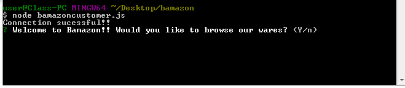

# bamazon

Welcome to Bamazon!!! The leading cli application store front built with MySQL and Node.JS. 

The Bamazon store front allows you to display the items we have in stock, you can then browse our stock, select the item that you wish to purchase via ID number, specify the quantity of the item you would like to purchase and before you know it you are the owner of a brand new piece of something!

Instructions:

We call the store by running the command "node bamazoncustomer.js" and we confirm that we are browsing Bamazon's wares

 

Next we are given a display of all the curreny items that Bamazon has

      
